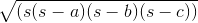
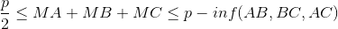

# TP5 : Héritage

### Objectif
Utilisé l'héritage dans le cadre de la POO

- Sous-classe
- Classe Abstraite
- Interface

**On repart de la fin du TP3 (avec quelques légères adaptations) avec les 3 classes Dessin, Rectangle et Point ainsi que la classe Exec pour vos tests**

### Prérequis
- Cloner le projet sur votre poste dans le repertoire de votre choix
- Ouvrir le projet :
  - Sur l'écran d'accueil d'IntelliJ, cliquer sur **Open**
  - Sélectionner le dossier **tpX-xxx** qui a été copié depuis github puis cliqué sur **OK**.
  - Le projet s'ouvre
  - Allez vérifier que le SDK est bien sélectionné dans **File > Project Structure** onglet **Project**

### Utilisation de GIT

- Créer une nouvelle branche **prenomNom**
- Faire **1 commit** par exercice
- Ouvrir **une seule** *pull request* sur github et **ne pas** la fermer/merger !!

----

### Exercice 1

Regarder le code des 3 classes pour vous rappeler le contexte : 
- Une classe Point 
- Une classe Rectangle qui utilise la classe Point.
- Une classe Dessin qui contient un tableau de rectangles.

Vous pouvez exécuter le main dans Exec et créer des rectangles et voir le plus grand rectangle, la surface et le périmètre de tous les rectangles.

On ajoute une nouvelle figure : **les disques**, un disque est caractérisé par son centre et son rayon.  
Créer une classe **Disque** avec les constructeurs adaptés ainsi que les méthodes :
- **translate(double x, double y)** : Déplace le disque
- **retourneSurface()** : Calcul et retourne la surface du disque
- **retournePerimetre()** : Calcul et retourne le perimètre du disque
- **contient(Point)** : Retourne vrai si le point est dans le disque. 
- **toString()** : Retourne une chaine qui décrit le disque.

> Pensez a faire un commit !!  


### Exercice 2
Modifier la classe **Dessin** pour qu'on puisse ajouter des **Disques** en plus des **Rectangles**. 
Attention, il ne faut pas rajouter un nouveau tableau, il faut créer une nouvelle classe (**Figure**) et faire en sorte que Disque et Rectangles soient des figures
Modifier le type du tableau et le type dans les méthodes actuelles pour qu'il soit possible d'ajouter aussi bien un **Disque** qu'un **Rectangle**. 
Pensez au polymorphisme...

Penser à modifier la méthode qui retourne le plus grand rectangle pour qu'elle retourne la plus grande **figure**.

> Pensez a faire un commit !!  


### Exercice 3
Dans la méthode **main()** de la classe **Exec** :
  - Effacer tout le contenu de la méthdode main() mais laisser l'instanciation du dessin 
  - Créer des objects des rectangles et des disques
  - Ajouter les au dessin
  - Afficher la surface totale des Figures
  - Afficher les informations de la plus grande figure
  - Créer un point, est ce qu'il est dans une figure ?

> Pensez a faire un commit !!  

### Exercice 4
Ajouter des **Triangles**. Un triangle est défini par 3 points. Ajouter tout ce qu'il faut pour que le triangle soit une figure.

- Pour calculer la surface d'un triangle sans connaitre sa hauteur, on peut utiliser la formule du héron ci-dessous où **s** est le demi périmètre et a, b, c la longueur de chaque coté.



**Pensez à décomposer avec des méthodes privées (calcul des cotés, etc...) et à réutiliser les méthodes existantes
(périmètre, calcule des longueurs des côtés qui sont des distances entre 2 points)**


- Pour savoir si un point **M** appartient à un triangle, vous pouvez utiliser le théorème suivant où p est le périmètre et A, B, C sont les sommets et inf() retourne la plus petite valeur :




**Pensez à décomposer avec des méthodes privées (récupération du plus petit coté, etc...) et à réutiliser les méthodes existantes**  

> Pensez a faire un commit !!  

### Exercice 5
Dans la méthode **main()** de la classe **Exec** :
  - Ajouter plusieurs Triangles
  - Afficher la surface totale des Figures
  - Afficher les informations de la plus grande figure

> Pensez a faire un commit !!  

### Exercice 6

On considère maintenant que les rectangles ne sont plus nécessairement parallèles aux axes. Un rectangle incliné est un rectangle avec un angle (en degrés),
mais il conserve les mêmes autres propriétés et méthodes qu'un rectangle (il a une longueur, une largeur, un point d'origine, il peut translater, etc...)

Créer une classe **RectangleIncline** qui hérite de **Rectangle** avec une propriété supplémentaire : *angle* et les constructeurs appropriés.
Rappelez-vous qu'un constructeur d'une classe fille doit appeler le constructeur de la classe parent avec *super(...)*

> Pensez a faire un commit !!


### Exercice 7
Redefinir les méthodes de la classe **RectangleIncline** qui le nécessitent (On veut connaitre l'angle du rectangle s'il est incliné lorsqu'on affiche les informations du rectangle...)   
Pour savoir si un point est dans un rectangle incliné, vous pouvez utiliser le code suivant :

```java
     public boolean contient(Point point){
            double rotx =  point.x * Math.cos(this.angle) - point.y * Math.sin(this.angle);
            double roty = -point.x * Math.sin(this.angle) + point.y * Math.cos(this.angle);
            return (this.point.x <= rotx && rotx <= this.point.x + this.longueur &&
                    this.point.y <= roty && roty <= this.point.y + this.largeur);
    }
```

> Pensez a faire un commit !!

### Exercice 8
Modifier si nécessaire la classe Dessin pour qu'on puisse ajouter des rectangles inclinés.
Ajouter des rectangle inclinés dans la méthode **main()** de la classe **Exec**

> Pensez a faire un commit (si nécessaire...) !!  
> Pensez à faire un push (```git push origin nomPrenom```)  
> Si elle n'est pas déjà ouverte, ouvrez une pull request (branche **prenomNom** vers **master**) NE PAS LA FERMER/MERGER !

### Exercice 9
Rajouter une classe carré
